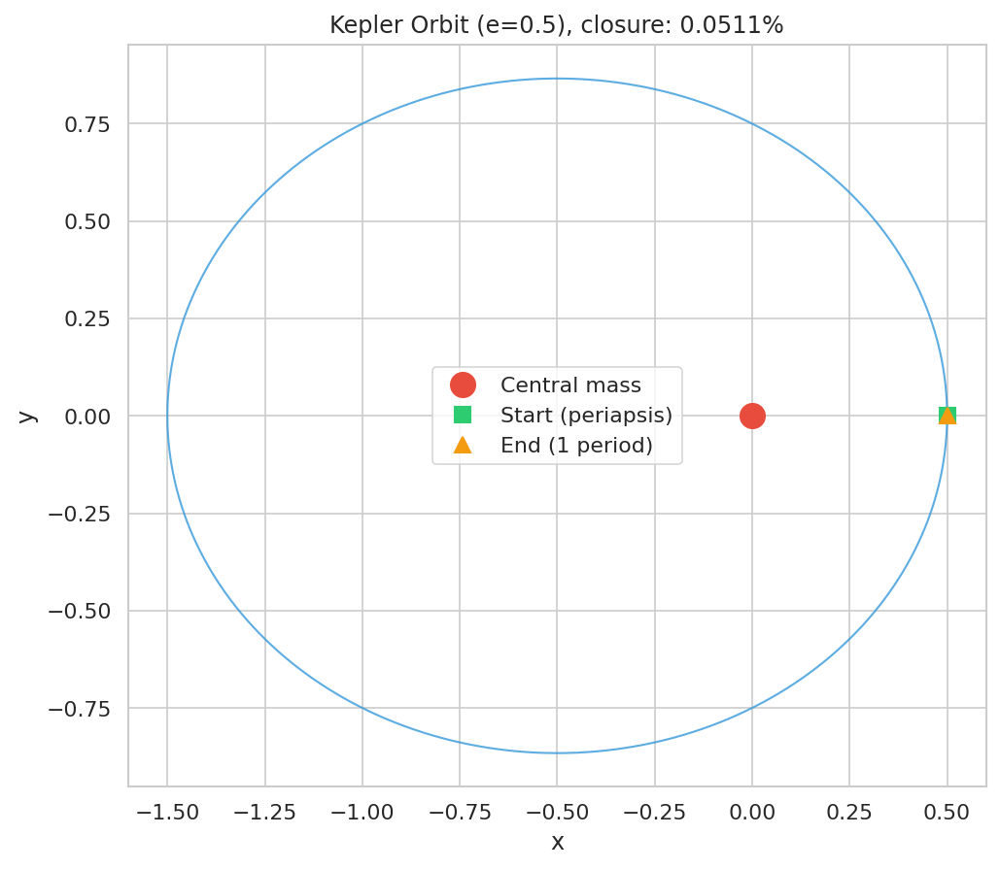
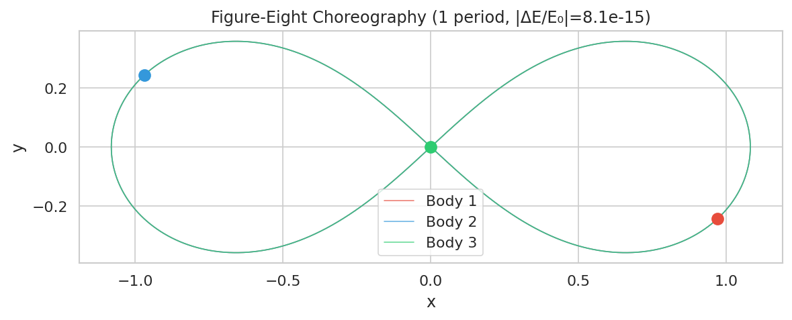
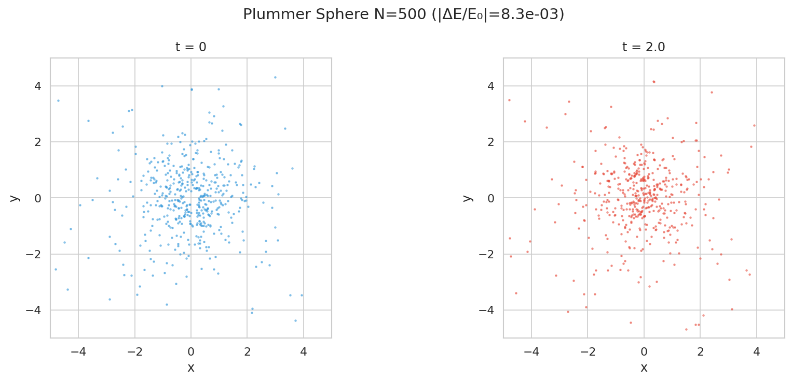

# Minimal N-Body Gravity Simulation

A modular 2D N-body gravitational simulation with multiple force algorithms,
symplectic integrators, and comprehensive benchmarking tools.

## Features

- **Force algorithms**: Brute-force O(N^2), vectorized brute-force (NumPy), Barnes-Hut quadtree O(N log N)
- **Integrators**: Symplectic Euler (1st order), velocity-Verlet/leapfrog (2nd order), Yoshida (4th order), adaptive timestep
- **Diagnostics**: Energy, linear momentum, and angular momentum conservation tracking
- **Visualization**: Trajectory plots and snapshot rendering with publication-quality styling
- **Canonical test problems**: Kepler orbit, figure-eight choreography, Plummer sphere

## Installation

```bash
pip install -r requirements.txt
```

Dependencies: numpy >= 1.20, matplotlib >= 3.5, seaborn >= 0.12, pytest >= 7.0

## Usage

### Basic simulation

```bash
python sim.py --n 10 --dt 0.01 --steps 1000
```

### Kepler orbit with Yoshida integrator

```python
from src.initial_conditions import kepler_elliptical
from src.forces.brute_force_vec import compute_forces_vectorized
from src.integrators.yoshida import yoshida_step
from src.metrics import total_energy

system = kepler_elliptical(e=0.5)
acc = compute_forces_vectorized(system)
E0 = total_energy(system)

for _ in range(10000):
    acc = yoshida_step(system, acc, dt=0.001, force_func=compute_forces_vectorized)
```

### Figure-eight 3-body visualization

```python
from src.initial_conditions import figure_eight
from src.visualization import plot_trajectories

system = figure_eight()
# ... run simulation collecting trajectory history ...
plot_trajectories(trajectories, "figures/my_plot.png")
```

### Barnes-Hut for large N

```python
from src.initial_conditions import plummer_sphere
from src.forces.barnes_hut import compute_forces_barnes_hut
from src.integrators.leapfrog import leapfrog_step

system = plummer_sphere(N=5000, seed=42)
force_func = lambda s: compute_forces_barnes_hut(s, theta=0.5)
acc = force_func(system)

for _ in range(100):
    acc = leapfrog_step(system, acc, dt=0.01, force_func=force_func)
```

## Algorithms

### Force Computation

| Algorithm | Complexity | Description |
|-----------|-----------|-------------|
| Brute-force | O(N^2) | Direct pairwise summation with softening |
| Brute-force (vec) | O(N^2) | NumPy-vectorized, ~58x faster than loop version |
| Barnes-Hut | O(N log N) | Quadtree with monopole + quadrupole moments |

The Barnes-Hut algorithm (Barnes & Hut, 1986) uses a hierarchical quadtree
to approximate gravitational forces from distant particle groups. The opening
angle parameter theta controls the accuracy-speed trade-off: smaller theta gives
higher accuracy at greater cost. Our implementation includes quadrupole moment
corrections for improved accuracy, achieving < 0.4% RMS error at theta = 0.5.

### Integrators

| Integrator | Order | Symplectic | Force evals/step |
|-----------|-------|------------|-----------------|
| Symplectic Euler | 1st | Yes | 1 |
| Leapfrog (Verlet) | 2nd | Yes | 1 |
| Yoshida | 4th | Yes | 3 |
| Adaptive leapfrog | 2nd | Yes | 1 (variable dt) |

The Yoshida 4th-order integrator (Yoshida, 1990) composes three leapfrog
sub-steps with specially chosen coefficients to cancel leading error terms.
On a Kepler orbit, it achieves 2749x better energy conservation than leapfrog
at equivalent computational cost.

The leapfrog/velocity-Verlet scheme (Verlet, 1967) is a 2nd-order symplectic
integrator that exactly conserves a modified Hamiltonian, preventing secular
energy drift.

## Results

### Convergence Orders


Leapfrog shows clean 2nd-order convergence (slope = 2.00). Yoshida shows
4th-order convergence (slope = 3.98, limited by machine precision at small dt).

### Barnes-Hut Scaling


Barnes-Hut interaction count scales with exponent ~1.3 (sub-quadratic),
compared to O(N^2) for brute-force, confirming the expected O(N log N) complexity.

### Canonical Test Problems





## Running Tests

```bash
python -m pytest tests/ -v
python -m pytest tests/ --cov=src --cov-report=term
```

## Running Benchmarks

```bash
python benchmarks/run_comparison.py      # BH vs brute-force scaling
python benchmarks/run_integrator_comparison.py  # Integrator accuracy
python benchmarks/run_theta_sweep.py     # BH theta parameter study
python benchmarks/run_convergence.py     # Convergence orders
python benchmarks/run_canonical_tests.py # Canonical test problems
```

## Project Structure

```
src/
  bodies.py              # Body/System data structures
  forces/
    brute_force.py       # Loop-based O(N^2)
    brute_force_vec.py   # NumPy-vectorized O(N^2)
    barnes_hut.py        # Barnes-Hut quadtree O(N log N)
  integrators/
    euler.py             # Symplectic Euler (1st order)
    leapfrog.py          # Velocity-Verlet (2nd order)
    yoshida.py           # Yoshida (4th order)
    adaptive.py          # Adaptive timestep leapfrog
  metrics.py             # Energy and momentum conservation
  visualization.py       # Plotting utilities
  initial_conditions.py  # Canonical test problem generators
tests/                   # Unit tests
benchmarks/              # Benchmark and experiment scripts
results/                 # JSON output from experiments
figures/                 # Generated plots (PNG + PDF)
```

## References

- Barnes, J. & Hut, P. (1986). "A hierarchical O(N log N) force-calculation algorithm." *Nature*, 324, 446-449.
- Verlet, L. (1967). "Computer experiments on classical fluids." *Physical Review*, 159, 98-103.
- Yoshida, H. (1990). "Construction of higher order symplectic integrators." *Physics Letters A*, 150, 262-268.
- Hairer, E., Lubich, C. & Wanner, G. (2006). *Geometric Numerical Integration*. Springer.
- Springel, V. (2005). "The cosmological simulation code GADGET-2." *MNRAS*, 364, 1105-1134.
- Chenciner, A. & Montgomery, R. (2000). "A remarkable periodic solution of the three-body problem." *Annals of Mathematics*, 152, 881-901.
