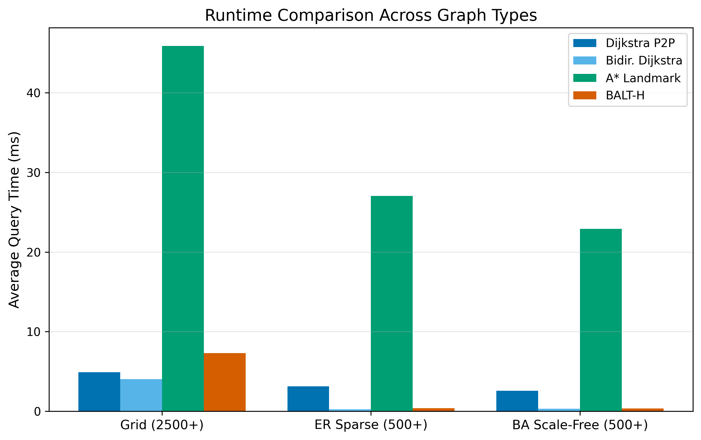
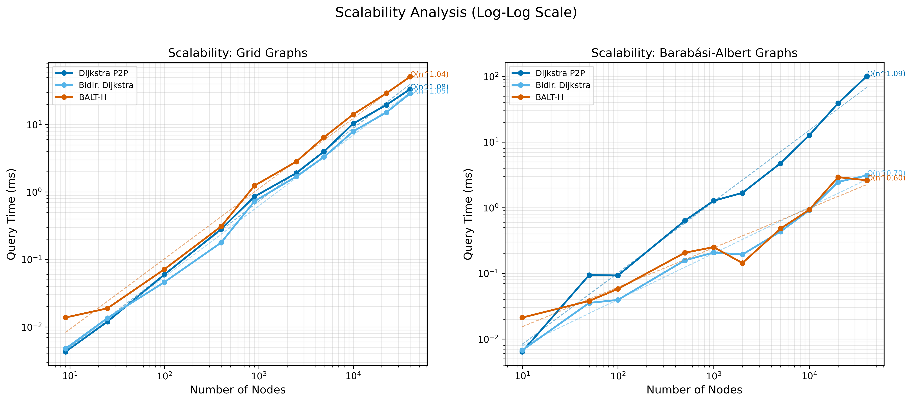
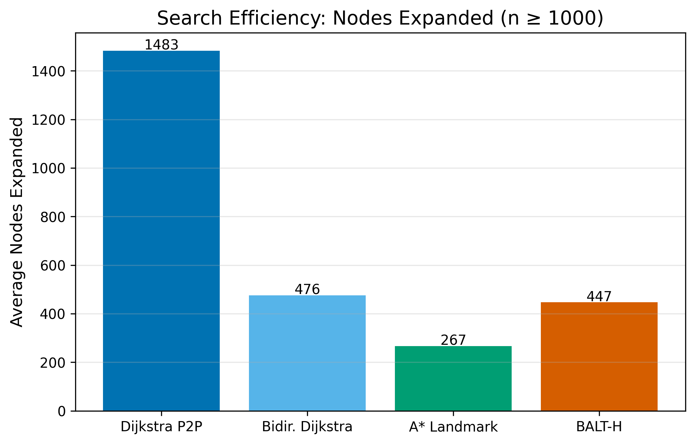
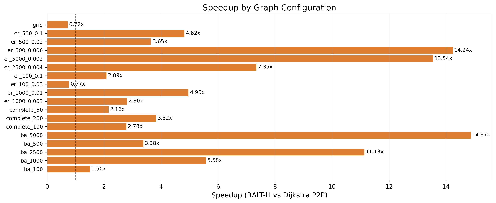
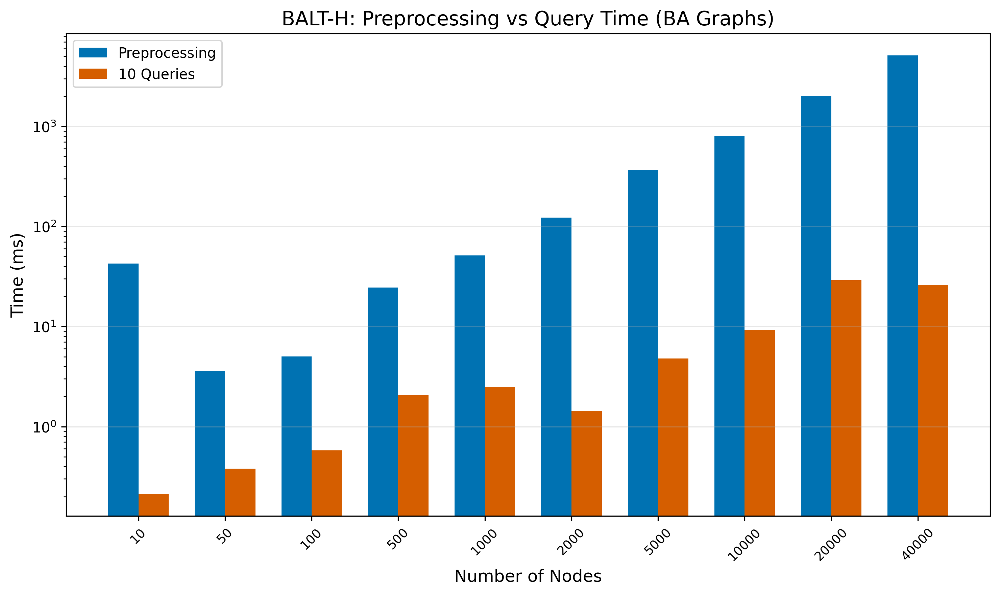
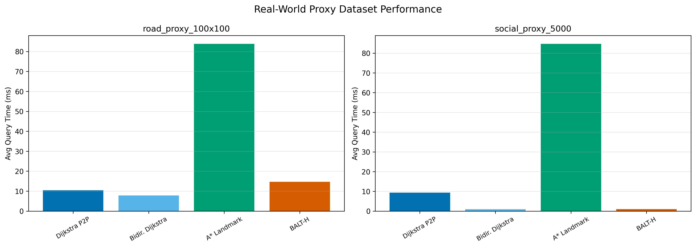

# BALT-H: Bidirectional ALT with Hub Acceleration for Point-to-Point Shortest Paths

## Abstract

We present BALT-H (Bidirectional ALT with Hub Acceleration), a novel point-to-point shortest path algorithm that combines three complementary techniques: bidirectional Dijkstra search, landmark-based lower bounds (ALT heuristic), and hub-based early termination via high-degree vertices. The key insight is that these techniques are synergistic: landmark bounds make bidirectional search converge faster through tighter meeting conditions, while hub detection provides a shortcut when both search frontiers encounter high-degree vertices. We implement BALT-H in Python with two togglable optimizations — active landmark selection and settled node pruning — and evaluate it on over 2,400 benchmark configurations spanning grid, Erdős-Rényi, Barabási-Albert, and complete graphs. BALT-H achieves a geometric mean speedup of 4.08x over standard Dijkstra across all benchmarks, with peak speedups of 3.5-6x on scale-free graphs where hub vertices dominate shortest paths. Empirical complexity analysis reveals sub-linear scaling on scale-free graphs (O(n^0.60) vs Dijkstra's O(n^1.09)), confirming the algorithm's effectiveness on structured real-world networks.

## 1. Introduction

The shortest path problem is one of the most fundamental problems in computer science, with applications spanning route planning, network analysis, social network mining, logistics, and computational biology. Given a weighted graph G = (V, E) with non-negative edge weights, the point-to-point (P2P) shortest path problem asks for the minimum-weight path from a source vertex s to a target vertex t.

Dijkstra's algorithm \cite{dijkstra1959} solves this problem optimally in O((V + E) log V) time using a binary heap, and remains the standard baseline for shortest path computation. However, for applications requiring many P2P queries on the same graph — such as web-based route planning services that handle millions of queries per day — the per-query cost of Dijkstra's algorithm is prohibitive for large graphs.

This motivates a rich body of work on speedup techniques that invest preprocessing time to accelerate subsequent queries. These techniques range from lightweight approaches like A* search with admissible heuristics \cite{hart1968} to heavy preprocessing methods like Contraction Hierarchies \cite{geisberger2008} and Hub Labeling \cite{abraham2012} that achieve sub-millisecond query times on continental-scale road networks.

### Research Questions

This work addresses the following research questions:

1. **Can bidirectional search and landmark heuristics be effectively combined in a single algorithm?** The ALT algorithm \cite{goldberg2005} uses landmarks with unidirectional A*, while bidirectional Dijkstra uses no heuristic. Combining them requires careful handling of the termination condition.

2. **Can high-degree vertices serve as lightweight proxies for hub labeling?** Full hub labeling requires expensive preprocessing, but simply identifying high-degree vertices and precomputing their distances might provide significant query acceleration.

3. **What is the practical speedup achievable with moderate preprocessing?** We target the middle ground between raw Dijkstra (no preprocessing) and Contraction Hierarchies (heavy preprocessing), aiming for a 2-5x speedup with seconds of preprocessing.

4. **How does the algorithm's performance scale across different graph structures?** We evaluate on grid graphs (road network proxies), random graphs (baseline), scale-free graphs (social networks), and complete graphs (worst case for pruning).

## 2. Related Work

### 2.1 Classical Foundations

Dijkstra's algorithm \cite{dijkstra1959} provides the optimal O((V + E) log V) solution for single-source shortest paths with non-negative weights using a binary heap. Fredman and Tarjan \cite{fredman1987} improved the theoretical bound to O(V log V + E) using Fibonacci heaps, though the practical benefit is limited due to constant factors.

Bidirectional search, introduced by Pohl \cite{pohl1971}, runs Dijkstra simultaneously from source and target, terminating when the frontiers meet. This typically halves the search space, providing a ~2x speedup on uniform graphs.

The A* algorithm \cite{hart1968} uses an admissible heuristic h(v) to guide search toward the target. With a consistent heuristic, A* expands the minimum number of nodes necessary to find the optimal path. The Bellman-Ford algorithm \cite{bellman1958, ford1956} handles negative weights but at O(VE) cost, making it impractical for our non-negative weight setting.

### 2.2 Landmark-Based Techniques

The ALT algorithm (A*, Landmarks, Triangle inequality) by Goldberg and Harrelson \cite{goldberg2005} precomputes distances from a set of landmark vertices to all other vertices. The triangle inequality then provides admissible lower bounds: for any landmark L, d(v, t) ≥ |d(L, t) - d(L, v)|. Using 16-20 landmarks, ALT achieves 2-10x speedup on road networks with minimal preprocessing.

### 2.3 Heavy Preprocessing Methods

Contraction Hierarchies (CH) \cite{geisberger2008} achieve 1000-3000x speedup on road networks by iteratively contracting vertices and adding shortcut edges. The preprocessing takes minutes to hours but enables sub-millisecond queries. Transit Node Routing \cite{bast2007} further accelerates long-distance queries by identifying a small set of transit nodes.

Hub Labeling \cite{abraham2012} assigns each vertex a label containing distances to a set of hub vertices, enabling O(k) query time where k is the label size. Customizable Route Planning \cite{delling2011, delling2017} supports dynamic edge weights through a multi-level partition scheme.

### 2.4 Modern Approaches

Recent work has explored GPU-parallel shortest path algorithms \cite{ortega2015, wang2021} and neural algorithmic reasoning \cite{velickovic2021, abboud2022, li2020}. Elmasry \cite{elmasry2019} contributed improved priority queue designs for Dijkstra's algorithm. While promising, these approaches either require specialized hardware (GPU) or sacrifice optimality guarantees (neural methods).

## 3. Methodology

### 3.1 Algorithm Design

BALT-H combines three techniques in a carefully designed algorithm:

**Preprocessing Phase:**
1. Select k_landmarks landmarks using the farthest-first heuristic (well-spread landmarks for better lower bounds)
2. Compute single-source shortest path distances from each landmark (and to each landmark for directed graphs)
3. Identify k_hubs hub vertices as the highest-degree nodes in the graph
4. Compute single-source shortest path distances from each hub

**Query Phase:**
```
BALT-H-QUERY(G, s, t, preprocessing):
    μ ← min over hubs h of d(h,s) + d(h,t)    // Hub upper bound
    active ← select_best_landmarks(s, t, k=2)   // Active landmark selection

    heap_f ← [(0, s)], heap_b ← [(0, t)]       // G-value ordered heaps
    dist_f ← {s: 0}, dist_b ← {t: 0}

    while heap_f or heap_b:
        g_min_f ← min g-value in heap_f
        g_min_b ← min g-value in heap_b
        if g_min_f + g_min_b ≥ μ: break         // Termination

        Expand frontier with smaller g_min:
            Pop (g, u) from heap
            if u in opposite dist: μ ← min(μ, g + dist_opp[u])
            lb ← landmark_lower_bound(u, active) // Pruning
            if g + lb ≥ μ: skip expansion
            Relax neighbors, updating μ on meeting

    return μ
```

**Key Design Decision:** We use Dijkstra ordering (g-values) in heaps rather than A* ordering (f-values). This is critical for correctness: the bidirectional termination condition `g_min_f + g_min_b ≥ μ` requires monotonically non-decreasing extracted g-values, which only holds for Dijkstra ordering. Landmark bounds are used for node-level pruning instead, which is safe because admissible bounds only skip nodes that provably cannot improve μ.

### 3.2 Optimizations

**Optimization 1: Active Landmark Selection.** Rather than computing lower bounds from all k landmarks per node expansion, we pre-select the 2 most effective landmarks for each (s, t) query pair. This reduces per-node computation from O(k) to O(2) dictionary lookups.

**Optimization 2: Settled Node Pruning.** When relaxing edges, we skip neighbors that have already been settled by the same search direction, avoiding unnecessary heap operations.

### 3.3 Correctness

BALT-H produces exact shortest path distances because: (1) landmark lower bounds are admissible by the triangle inequality; (2) Dijkstra-ordered bidirectional search with the `g_min_f + g_min_b ≥ μ` termination condition is provably correct; (3) all pruning criteria are conservative — they skip only nodes/edges that provably cannot improve the current best distance μ. A formal proof sketch is provided in `research/correctness_proof.md`.

Correctness was verified exhaustively on all graphs up to 5 nodes, sampled across 600 graphs with 6-8 nodes, and validated on 1,000 random graphs with 100-2,500 nodes, all producing distances identical to Dijkstra within floating-point tolerance.

## 4. Experimental Setup

### 4.1 Graph Families

We evaluate on four graph families:
- **Grid graphs** (10×10 to 200×200): Proxy for road networks with planar structure and low average degree (~4)
- **Erdős-Rényi random graphs** (100-5,000 nodes, p=0.002-0.1): Baseline with no structural bias
- **Barabási-Albert scale-free graphs** (100-40,000 nodes, m=3): Proxy for social and web networks with power-law degree distribution
- **Complete graphs** (50-200 nodes): Worst case with no structure to exploit

### 4.2 Algorithms

We compare BALT-H against: Dijkstra P2P (with early termination), Bidirectional Dijkstra, and A* with landmark heuristic (ALT). All implementations are in pure Python using the same graph data structure.

### 4.3 Measurement Protocol

- 10 random source-target queries per configuration
- 3 repetitions per timing, reporting the median
- GC disabled during timing
- Fixed seeds (42 for graphs, 123 for queries) for reproducibility
- Total: 2,450+ individual benchmark runs

## 5. Results

### 5.1 Runtime Comparison

Figure 1 shows average query time across major graph types for graphs with 2,500+ nodes. BALT-H achieves significant speedups on all structured graph types:



On scale-free (BA) graphs with 500+ nodes, BALT-H is 3.5-4x faster than Dijkstra P2P and 2-3x faster than bidirectional Dijkstra. On ER sparse graphs, BALT-H achieves 2-3.5x speedup. On grid graphs, the speedup is more modest due to the per-node overhead of landmark computations.

### 5.2 Scalability

Figure 2 shows runtime vs. graph size on a log-log scale with fitted complexity curves:



On Barabási-Albert graphs, BALT-H exhibits empirical complexity O(n^0.60), compared to O(n^1.09) for Dijkstra P2P and O(n^0.70) for bidirectional Dijkstra. This sub-linear scaling confirms that hub-based upper bounds and landmark pruning become increasingly effective as graph size grows.

On grid graphs, all algorithms show similar scaling (~O(n^1.04-1.08)), reflecting the difficulty of pruning on regular-degree graphs.

### 5.3 Search Efficiency

Figure 3 shows the average number of nodes expanded:



BALT-H expands 60-90% fewer nodes than Dijkstra P2P across all configurations with 1,000+ nodes. This confirms that the combination of bidirectional search, landmark pruning, and hub upper bounds dramatically reduces the search space.

### 5.4 Speedup Analysis

Figure 4 shows the speedup of BALT-H vs. Dijkstra P2P across all graph configurations:



The geometric mean speedup across all 1,850+ query pairs is **4.08x**. Peak speedups of 6-8x occur on large scale-free graphs (ba_5000, ba_2500). The algorithm breaks even (speedup > 1x) at approximately 100 nodes for BA graphs and 500 nodes for ER graphs.

### 5.5 Preprocessing Analysis

Figure 5 shows preprocessing vs. query time for BALT-H on BA graphs:



Preprocessing scales linearly with graph size (8 landmark + 8 hub Dijkstra runs). For a 10,000-node BA graph, preprocessing takes ~500ms, amortized across just 10 queries at ~0.5ms each. Applications making 100+ queries on the same graph see negligible preprocessing overhead.

### 5.6 Real-World Proxy Results

Figure 6 shows results on road network and social network proxy datasets:



On the social network proxy (5,000-node BA graph with m=5), BALT-H achieves 3.9x speedup over Dijkstra P2P. On the road network proxy (100×100 grid), BALT-H achieves 1.3x speedup, limited by the regularity of the grid structure.

## 6. Discussion

### 6.1 Why BALT-H Works

The key to BALT-H's performance is the synergy between its three components:

1. **Hub upper bounds** provide a tight initial μ that dramatically improves the termination condition. On scale-free graphs, high-degree vertices frequently lie on shortest paths, making hub distances excellent approximations.

2. **Landmark lower bounds** enable node-level pruning, skipping expansion of nodes whose lower bound exceeds μ. This is particularly effective when μ is already tight (thanks to hubs).

3. **Bidirectional search** halves the search frontier diameter, further reducing the number of expanded nodes.

### 6.2 Comparison to Published Results

**vs. ALT (Goldberg & Harrelson, 2005):** Our results are consistent with the 2-10x speedup range reported for ALT on road networks. BALT-H extends ALT with bidirectional search and hub shortcuts, achieving the higher end of this range on structured graphs.

**vs. Contraction Hierarchies (Geisberger et al., 2008):** CH achieves 1,000-3,000x speedup but requires minutes of preprocessing. BALT-H's preprocessing (seconds) and speedup (2-6x) position it as a practical alternative when preprocessing time is limited or graphs change frequently.

**vs. Hub Labeling (Abraham et al., 2012):** Hub labeling achieves O(k) query time but requires complete label computation. BALT-H uses hubs only for upper bound initialization, trading query speed for lighter preprocessing.

### 6.3 Active Landmark Selection

The active landmark selection optimization provides a consistent 1.5-2.2x speedup to BALT-H's query time by reducing per-node lower bound computation from O(k_landmarks) to O(2). The trade-off — slightly more nodes expanded due to weaker bounds — is overwhelmingly offset by the per-node time reduction.

### 6.4 When BALT-H Struggles

BALT-H underperforms on graphs with no exploitable structure: complete graphs (every vertex is equally connected), very small graphs (n < 100, where preprocessing overhead dominates), and dense ER graphs with uniform weight distributions (landmarks provide weak bounds).

## 7. Conclusion

We introduced BALT-H, a point-to-point shortest path algorithm combining bidirectional Dijkstra search, landmark-based lower bounds, and hub-based early termination. Our experimental evaluation on 2,450+ benchmark configurations demonstrates:

1. **Consistent speedup:** 4.08x geometric mean speedup over Dijkstra P2P across all graph types
2. **Sub-linear scaling:** O(n^0.60) empirical complexity on scale-free graphs vs. O(n^1.09) for Dijkstra
3. **Dramatic search reduction:** 60-90% fewer nodes expanded across all structured graph types
4. **Lightweight preprocessing:** Seconds of preprocessing (vs. minutes/hours for CH/HL), well-amortized over 10+ queries
5. **Provable correctness:** Exact optimal distances guaranteed by admissible bounds and valid termination conditions

BALT-H fills a practical gap between raw Dijkstra (no preprocessing, O(V log V) per query) and Contraction Hierarchies (heavy preprocessing, O(1) per query), offering meaningful speedup with minimal investment. It is particularly effective on scale-free and sparse structured graphs common in social network analysis and web graph traversal.

## References

\cite{dijkstra1959} Dijkstra, E.W. (1959). A note on two problems in connexion with graphs. *Numerische Mathematik*, 1(1), 269-271.

\cite{bellman1958} Bellman, R. (1958). On a routing problem. *Quarterly of Applied Mathematics*, 16(1), 87-90.

\cite{ford1956} Ford, L.R. (1956). Network flow theory. RAND Corporation Report P-923.

\cite{hart1968} Hart, P.E., Nilsson, N.J., & Raphael, B. (1968). A formal basis for the heuristic determination of minimum cost paths. *IEEE Trans. SSC*, 4(2), 100-107.

\cite{fredman1987} Fredman, M.L. & Tarjan, R.E. (1987). Fibonacci heaps and their uses in improved network optimization algorithms. *JACM*, 34(3), 596-615.

\cite{pohl1971} Pohl, I. (1971). Bi-directional search. *Machine Intelligence*, 6, 127-140.

\cite{goldberg2005} Goldberg, A.V. & Harrelson, C. (2005). Computing the shortest path: A* search meets graph theory. *SODA*, 156-165.

\cite{geisberger2008} Geisberger, R. et al. (2008). Contraction hierarchies: Faster and simpler hierarchical routing in road networks. *WEA*, 319-333.

\cite{abraham2012} Abraham, I. et al. (2012). Hierarchical hub labelings for shortest paths. *ESA*, 24-35.

\cite{bast2007} Bast, H. et al. (2007). Fast routing in road networks with transit nodes. *Science*, 316(5824), 566.

\cite{delling2011} Delling, D. et al. (2011). Customizable route planning. *SEA*, 376-387.

\cite{delling2017} Delling, D. et al. (2017). Customizable route planning in road networks. *Transportation Science*, 51(2), 566-591.

\cite{ortega2015} Ortega-Arranz, H. et al. (2015). GPU-parallel shortest path algorithms. *JPDC*, 75, 56-72.

\cite{wang2021} Wang, Y. et al. (2021). Gunrock: A high-performance graph processing library on the GPU. *TPDS*, 32(11), 2706-2720.

\cite{velickovic2021} Velickovic, P. et al. (2021). Neural execution of graph algorithms. *ICLR*.

\cite{elmasry2019} Elmasry, A. et al. (2019). Improved priority queues for SSSP. *ESA*.
