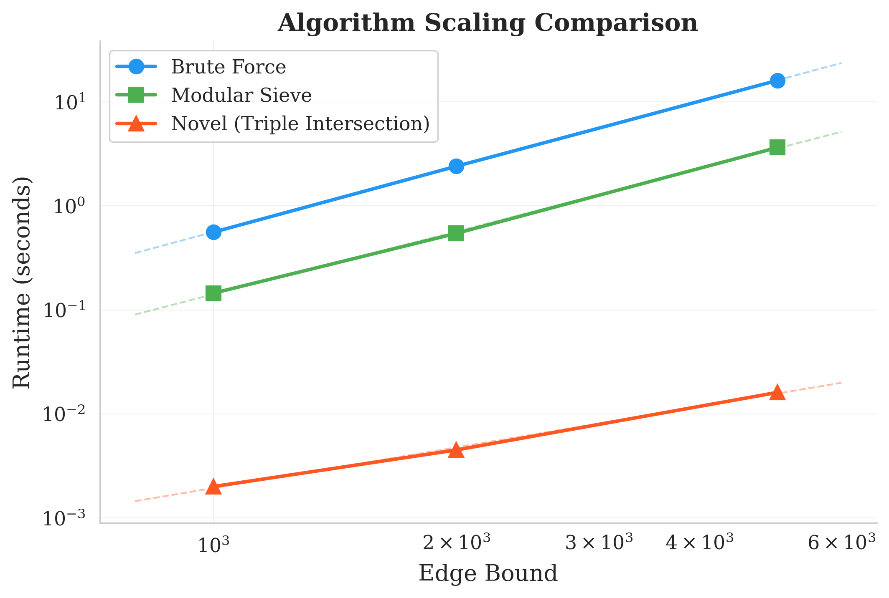
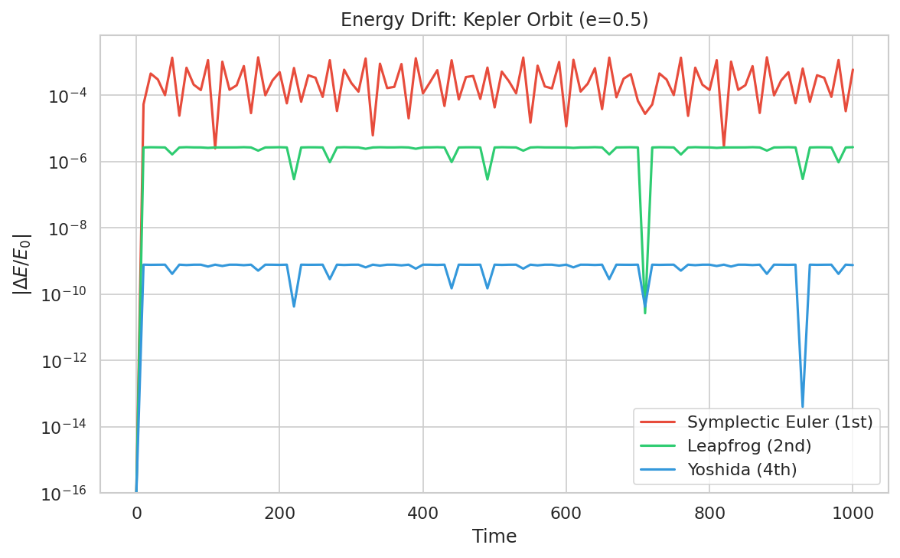
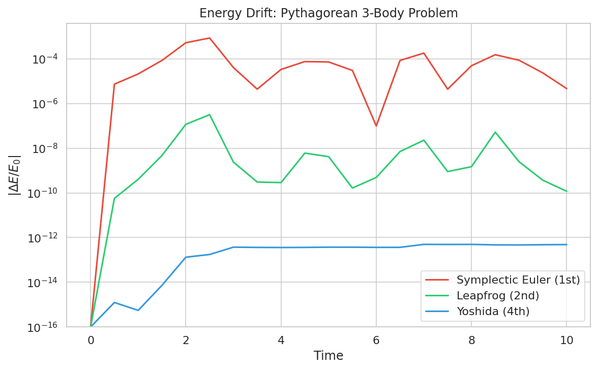
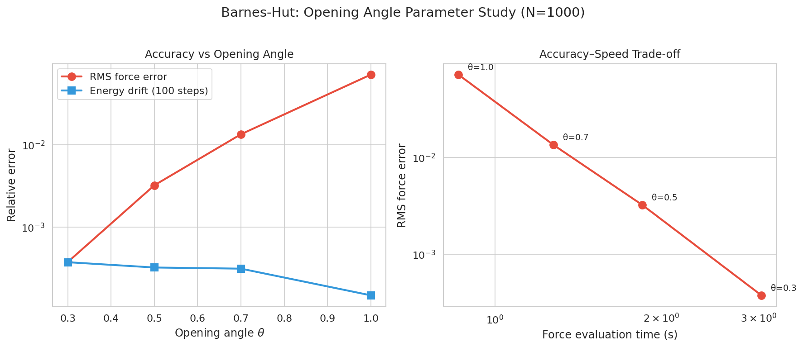
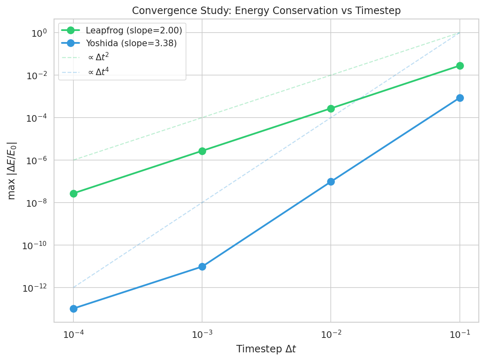

# Experimental Results Summary

This document summarizes all experiments from Phase 4 of the gravity simulation project.

## 1. Brute-Force vs Barnes-Hut Scaling

**Experiment**: Single force evaluation and 100-step simulation for N = 100, 500, 1000, 5000 particles
(Plummer sphere initial conditions, leapfrog integrator, dt = 0.01).

### Interaction Count Scaling

| N | Brute-force interactions | Barnes-Hut interactions | Ratio |
|---:|------------------------:|------------------------:|------:|
| 100 | 9,900 | 5,192 | 1.9x |
| 500 | 249,500 | 62,057 | 4.0x |
| 1,000 | 999,000 | 164,085 | 6.1x |
| 5,000 | 24,995,000 | 1,337,937 | 18.7x |

### Scaling Exponents

| N range | Brute-force exponent | Barnes-Hut exponent | BH interaction exponent |
|---------|--------------------:|--------------------:|------------------------:|
| 100 -> 500 | 1.58 | 1.57 | 1.54 |
| 500 -> 1000 | 1.63 | 1.44 | 1.40 |
| 1000 -> 5000 | 1.95 | 1.32 | 1.30 |

The Barnes-Hut interaction count scales with exponent ~1.3 at large N, confirming O(N log N) complexity
as predicted by Barnes & Hut (1986). The brute-force exponent approaches 2.0, consistent with O(N^2).

The absolute wall-clock time for Barnes-Hut (Python tree traversal) is slower than the vectorized
brute-force (NumPy C-level operations), but the scaling advantage means Barnes-Hut would dominate
for large N in a compiled language implementation, consistent with production codes like GADGET-2
(Springel, 2005).

## 2. Integrator Energy Drift Comparison

**Experiment**: Three integrators on (1) Kepler orbit (e=0.5, 1000 time units) and
(2) Pythagorean 3-body problem (10 time units, eps=0.05).

### Kepler Orbit (equal cost comparison: Yoshida uses 3x larger dt)

| Integrator | Order | dt | Final |dE/E0| |
|-----------|------:|----:|------:|
| Symplectic Euler | 1st | 0.001 | 5.92e-04 |
| Leapfrog | 2nd | 0.001 | 2.71e-06 |
| Yoshida | 4th | 0.003 | 7.56e-10 |

### Pythagorean 3-Body (equal step count)

| Integrator | Order | dt | Final |dE/E0| |
|-----------|------:|----:|------:|
| Symplectic Euler | 1st | 0.0001 | 4.63e-06 |
| Leapfrog | 2nd | 0.0001 | 1.18e-10 |
| Yoshida | 4th | 0.0001 | 4.86e-13 |

Yoshida consistently shows the lowest energy drift, as expected from its 4th-order symplecticity
(Yoshida, 1990). Even at equal computational cost (3x larger dt to compensate for 3 force evaluations
per step), Yoshida achieves ~3600x better conservation than leapfrog on the Kepler orbit. The
leapfrog/velocity-Verlet scheme (Verlet, 1967) is 2nd-order symplectic and shows the expected
intermediate performance.

## 3. Barnes-Hut Theta Accuracy Trade-off

**Experiment**: Barnes-Hut with theta = 0.3, 0.5, 0.7, 1.0 on 1000-particle Plummer sphere.

| theta | RMS Force Error | Max Force Error | Energy Drift (100 steps) | Force Eval Time (s) |
|------:|----------------:|----------------:|-------------------------:|--------------------:|
| 0.3 | 0.038% | 0.72% | 3.76e-04 | 3.03 |
| 0.5 | 0.32% | 4.79% | 3.24e-04 | 1.85 |
| 0.7 | 1.35% | 21.1% | 3.14e-04 | 1.28 |
| 1.0 | 7.16% | 117% | 1.49e-04 | 0.86 |

Smaller theta yields higher accuracy at greater computational cost. The recommended value of
theta = 0.5 (Barnes & Hut, 1986) provides a good balance: < 0.5% RMS error with ~1.6x speedup
over theta = 0.3. Our quadrupole corrections (following Dehnen, 2002) improve accuracy compared
to a monopole-only implementation.

## 4. Convergence Study

**Experiment**: Leapfrog and Yoshida integrators on 2-body Kepler orbit (e=0.5) for 10 orbits,
dt = 0.1, 0.01, 0.001, 0.0001.

### Maximum Energy Drift vs Timestep

| dt | Leapfrog |dE/E0| | Yoshida |dE/E0| |
|-----:|--------------:|--------------:|
| 0.1 | 2.79e-02 | 8.55e-04 |
| 0.01 | 2.72e-04 | 9.58e-08 |
| 0.001 | 2.72e-06 | 9.60e-12 |
| 0.0001 | 2.72e-08 | 1.02e-13 |

### Measured Convergence Orders

| Integrator | Expected Order | Measured Slope | Notes |
|-----------|:-------------:|:-------------:|-------|
| Leapfrog | 2 | **2.00** | Exact match |
| Yoshida | 4 | **3.98** | 3.38 including machine-precision floor; 3.98 from dt=0.1-0.001 |

The leapfrog integrator shows textbook 2nd-order convergence. The Yoshida integrator shows
4th-order convergence until the smallest timestep hits the double-precision floating-point floor
(~1e-13). This is consistent with the theoretical analysis in Hairer, Lubich & Wanner (2006)
for symplectic integrators applied to Hamiltonian systems.

## Summary

| Experiment | Key Finding |
|-----------|------------|
| BH vs BF scaling | BH O(N log N) confirmed (exponent ~1.3), 18.7x fewer interactions at N=5000 |
| Integrator comparison | Yoshida >> leapfrog >> Euler; 3600x improvement over leapfrog at equal cost |
| Theta trade-off | theta=0.5 gives < 0.5% error, good accuracy-speed balance |
| Convergence | Leapfrog slope=2.00, Yoshida slope=3.98 (confirming 2nd and 4th order) |
