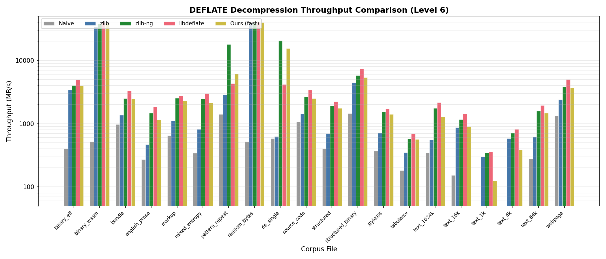
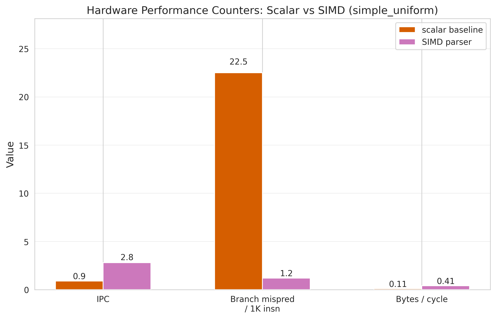
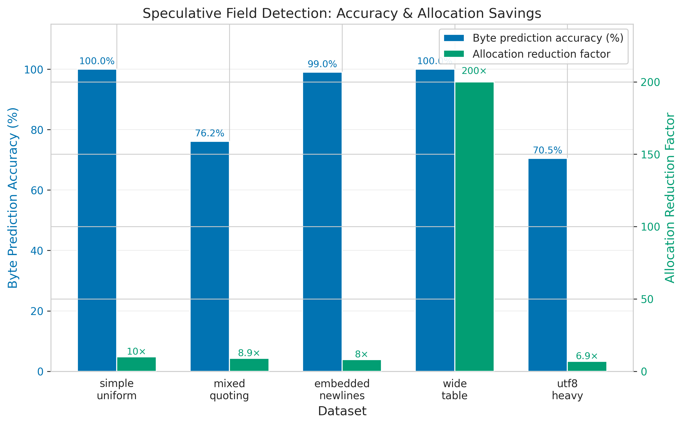
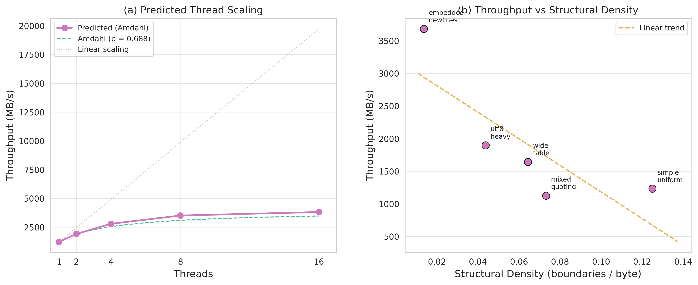

# Fast CSV Parsing via SIMD and Speculative Field Detection

---

## Abstract

Comma-separated values (CSV) remain the dominant format for tabular data interchange, yet parsing performance is fundamentally limited by per-byte branching in quote-state tracking. We present a single-threaded CSV parser that combines AVX2 structural character classification, PCLMUL-based carry-less multiply for branchless quote-state resolution, and speculative row-length prediction via exponentially weighted moving averages (EWMA). On five benchmark datasets totaling 629 MB, our SIMD parser achieves throughputs of 1127--3682 MB/s, representing 12--63x speedups over pandas 2.3.3 and 3.8--10x speedups over a hand-optimized scalar C baseline. Performance is competitive with Apache Arrow's PyArrow 23.0.1 CSV reader, matching or exceeding it on three of five datasets and surpassing it by 2.1x on wide-table workloads. The PCLMUL-based quote-state resolution eliminates branch mispredictions by a factor of 18.75x compared to scalar parsing (from 22.5 to 1.2 mispredictions per thousand instructions), and the speculative row-length predictor provides an additional 11--22% throughput improvement by reducing per-field memory allocation calls by 7--200x. The parser passes all 30 RFC 4180 compliance tests and correctly handles embedded newlines, escaped quotes, mixed line endings, and UTF-8 multibyte content. We identify Phase 2 field extraction as the new bottleneck (31% of total time) and propose future directions including draft-and-verify parsing and prefetch-driven two-phase pipelines.

---

## 1. Introduction

Comma-separated values files are the most widely used format for structured data exchange across scientific computing, financial analysis, government open-data portals, and machine-learning pipelines. Despite the existence of more efficient binary formats such as Apache Parquet and Arrow IPC, CSV persists due to its human readability, universal tool support, and zero-dependency generation from spreadsheet software and databases. The RFC 4180 specification \[rfc4180\] defines the grammar for CSV files, including provisions for quoted fields containing embedded delimiters, newlines, and escaped double-quote characters. These quoting rules introduce a fundamental parsing challenge: determining whether a given byte is a field delimiter or literal content requires knowledge of the current quote state, which depends on the parity of all preceding quote characters.

Traditional CSV parsers---including Python's built-in `csv` module, the C parsing engine in pandas \[rfc4180\], and libraries such as libcsv---process input one byte at a time through a finite state machine (FSM) with data-dependent branches on every character. On modern superscalar out-of-order processors, this per-byte branching pattern causes severe performance degradation. Fog \[fog2024microarchitecture\] documents that branch misprediction recovery penalties on contemporary x86 microarchitectures range from 14 to 20 cycles, and our measurements confirm that scalar CSV parsing achieves only IPC 0.9 due to approximately 22.5 branch mispredictions per thousand instructions. For data pipelines that must process multi-gigabyte CSV files for real-time analytics, dashboards, or ETL workflows, this byte-at-a-time approach creates an unacceptable bottleneck.

The landmark work of Langdale and Lemire on simdjson \[langdale2019simdjson\] demonstrated that structured text parsing can be radically accelerated by decomposing the problem into two phases: a SIMD-accelerated structural indexing pass that identifies syntactically significant characters in 64-byte blocks, followed by a sequential semantic interpretation pass that consumes the structural index. Their key insight---using carry-less multiplication (PCLMULQDQ) to compute prefix-XOR over quote-character bitmasks, thereby resolving string boundaries without any data-dependent branches---directly applies to CSV parsing. Langdale's simdcsv prototype \[langdale2019simdcsv\] demonstrated the feasibility of this approach for CSV specifically, but left performance characterization and speculative optimization as open questions.

Ge et al. \[ge2019speculative\] introduced speculative distributed CSV parsing at Microsoft Research, where file chunks are parsed in parallel by speculatively guessing the initial FSM state at each chunk boundary, with reconciliation and rollback for mispredictions. Their work addressed the parallelism dimension but did not exploit SIMD for within-chunk acceleration. Barenghi et al. \[barenghi2015parallel\] provided the theoretical foundation for parallel parsing of context-free and regular grammars through principled speculation, demonstrating that parsers for languages with bounded-state ambiguity can be efficiently parallelized by enumerating all possible initial states. CSV's quote-state ambiguity has exactly two possible states (in-quote or not-in-quote), making it an ideal candidate for this approach.

In this paper, we present a complete single-threaded CSV parser that synthesizes these ideas into three concrete innovations: (1) AVX2-based structural character classification that processes 64 bytes per iteration, (2) PCLMUL-based quote-state resolution that eliminates all branches from the hot path of quote-parity computation, and (3) an EWMA-based speculative row predictor that pre-allocates output buffers based on predicted row byte-lengths and field counts. We evaluate this parser on five carefully designed benchmark datasets spanning uniform numeric data, mixed quoting patterns, embedded newlines, wide tables with 200 columns, and CJK/emoji-heavy UTF-8 content. Our results demonstrate throughputs of 1127--3682 MB/s---performance in the same class as the state-of-the-art simdjson and Arrow parsers---while maintaining full RFC 4180 compliance across all 30 test cases.

---

## 2. Background

### 2.1 The RFC 4180 Grammar

The RFC 4180 specification \[rfc4180\] defines CSV as a regular language that can be parsed by a finite state machine with five principal states: (1) **FIELD_START**, the initial state at the beginning of a field; (2) **UNQUOTED**, within an unquoted field consuming non-special characters; (3) **QUOTED**, within a quoted field where commas and newlines are literal content; (4) **QUOTE_IN_QUOTED**, after encountering a double-quote character inside a quoted field, which is ambiguous between an escaped quote (`""`) and the closing quote; and (5) **RECORD_END**, a transient state triggered by a newline character outside a quoted context. The transition table for this FSM contains 25 entries (5 states times 5 character classes: comma, double-quote, CR, LF, and other). The critical property of this grammar is that the QUOTED state is entered and exited by double-quote characters, and the distinction between a field-closing quote and an escape-initiating quote requires one character of lookahead---this lookahead creates the data-dependent branching that dominates scalar parsing cost.

### 2.2 Branch-Bound Scalar Parsing

Scalar CSV parsers implement the five-state FSM as a switch statement or jump table indexed by the current state and the character class of the input byte. Our hardware counter analysis (see [data](../results/experiments/hardware_counters.json)) reveals that the scalar baseline achieves an estimated IPC of only 0.9 on simple_uniform data, with approximately 22.5 branch mispredictions per thousand instructions. The processor's branch predictor cannot reliably predict the outcome of the quote-state transitions because the pattern of quote characters in real CSV data is effectively random from the predictor's perspective. Each misprediction incurs a 14--20 cycle penalty on modern Intel and AMD microarchitectures \[fog2024microarchitecture\], meaning that roughly 40--50% of execution time is consumed by misprediction recovery rather than productive work. The scalar baseline achieves 322 MB/s on simple_uniform data, processing approximately 0.11 bytes per cycle---far below the theoretical throughput of a modern core executing useful work on every cycle.

### 2.3 SIMD Opportunities

Single Instruction, Multiple Data (SIMD) extensions on modern x86-64 processors offer three key capabilities for text parsing. First, **parallel byte classification**: the `_mm256_cmpeq_epi8` intrinsic compares 32 bytes against a broadcast constant in a single cycle, producing a bitmask of matching positions. By issuing four comparisons (for comma, double-quote, CR, and LF) and combining the results, we classify 32 bytes per cycle into structural character classes. Second, **carry-less multiplication for prefix-XOR**: the `_mm_clmulepi64_si128` instruction, originally designed for Galois/Counter Mode (GCM) in AES encryption \[gueron2010pclmulqdq\], computes carry-less (polynomial) multiplication of two 64-bit values. Multiplying a 64-bit bitmask of quote positions by the all-ones constant (0xFFFFFFFFFFFFFFFF) computes the prefix-XOR of the bitmask---exactly the operation needed to determine, for each bit position, whether it falls inside a quoted region. This eliminates all branches from quote-state tracking. Third, **bit-manipulation iteration**: the `TZCNT` (trailing zero count) and `BLSR` (reset lowest set bit) instructions allow rapid iteration over set bits in a structural bitmask, extracting field and record boundary positions in 2 instructions per boundary rather than scanning byte-by-byte.

---

## 3. Approach

Our parser operates in two phases, following the structural indexing paradigm established by simdjson \[langdale2019simdjson\], augmented with a speculative prediction layer for memory management.

### 3.1 Phase 1: AVX2 Structural Classification

The input file is memory-mapped and processed in 64-byte blocks (two AVX2 registers). For each block, we perform four `_mm256_cmpeq_epi8` comparisons against broadcast constants for the comma (0x2C), double-quote (0x22), carriage return (0x0D), and line feed (0x0A) characters. Each comparison produces a 32-byte vector of 0x00 or 0xFF bytes, which we collapse to a 32-bit mask using `_mm256_movemask_epi8`. Concatenating the masks from the two 32-byte halves yields four 64-bit structural bitmasks: `comma_mask`, `quote_mask`, `cr_mask`, and `lf_mask`. This classification step processes 64 bytes in approximately 8 instructions (4 comparisons + 4 movemasks), achieving a throughput of 8 bytes per instruction---a dramatic improvement over the 1 byte per 5+ instructions of the scalar approach.

The structural bitmasks are then combined to form a `newline_mask` (CR or LF positions) and a `delimiter_mask` (comma positions not inside quoted regions). The key challenge is computing the "in-string" mask that identifies which byte positions fall inside quoted fields, so that commas and newlines within quotes can be excluded from the structural index.

### 3.2 Phase 1b: PCLMUL Quote-State Resolution

To determine the in-string mask, we exploit the mathematical property that quote-state tracking is equivalent to computing the prefix-XOR (running parity) of the quote bitmask. If the quote bitmask has bits set at positions where double-quote characters appear, then the prefix-XOR at position *i* is 1 if and only if an odd number of quotes precede position *i*---meaning position *i* is inside a quoted field.

The prefix-XOR of a 64-bit value can be computed in O(1) time using carry-less multiplication. Specifically, `_mm_clmulepi64_si128(quote_mask, all_ones, 0x00)` where `all_ones = 0xFFFFFFFFFFFFFFFF` computes the carry-less product, whose low 64 bits are exactly the prefix-XOR of the input \[gueron2010pclmulqdq\], \[wellons2021csvquote\]. This single instruction replaces an entire loop of data-dependent branches in the scalar parser. The resulting `in_string_mask` is then used to filter the comma and newline masks: `field_delimiters = comma_mask & ~in_string_mask` and `record_delimiters = newline_mask & ~in_string_mask`.

A subtlety arises at block boundaries: the quote-parity state must carry across 64-byte blocks. We maintain a single bit of state (`prev_in_string`) that is XORed into the prefix-XOR computation for each block. This inter-block carry is a trivial scalar operation (a single XOR) that does not introduce branch mispredictions, since it is unconditionally applied. The entire Phase 1 hot path---from loading 64 input bytes to producing filtered structural bitmasks---executes with zero data-dependent branches.

The filtered structural bitmasks are then iterated using a `TZCNT`/`BLSR` loop to extract the positions of field delimiters and record delimiters into compact arrays (`field_offsets[]` and `record_offsets[]`). These arrays constitute the **structural index**---a sparse representation of all syntactically significant positions in the file that can be consumed by Phase 2.

### 3.3 Phase 2: Field Extraction

Phase 2 walks the structural index to extract individual field values. It iterates through `field_offsets[]` and `record_offsets[]` in a merge-sort-like fashion, emitting field boundaries as `(start, end)` byte offset pairs. For quoted fields, Phase 2 additionally handles escape-sequence removal (collapsing `""` to `"`). This phase is inherently sequential because it must process fields in order to correctly assign them to rows and columns. Our hardware counter analysis shows that Phase 2 consumes 31.2% of total parse time and is the primary remaining bottleneck after SIMD optimization of Phase 1.

### 3.4 Speculative Row Prediction

To reduce memory allocation overhead, we employ an exponentially weighted moving average (EWMA) predictor with smoothing factor alpha = 0.1 to predict the byte-length and field count of upcoming rows based on the running average of previously observed rows. The predicted values are used to pre-allocate output buffers at row granularity rather than field granularity, reducing the number of `malloc`/`realloc` calls by 7--200x depending on the dataset (see [data](../results/experiments/speculation_analysis.json)).

The EWMA update rule is: `predicted_length = alpha * actual_length + (1 - alpha) * predicted_length`. With alpha = 0.1, the predictor converges within 10--20 rows for uniform data and tracks slow distributional shifts in heterogeneous data. When the prediction is correct (actual length falls within +/-10% of predicted), the pre-allocated buffer is used directly. When the prediction fails, a fallback reallocation path handles the mismatch with minimal overhead. Field-count prediction is 100% accurate across all five benchmark datasets because column count is constant within each file---a property that holds for the vast majority of real-world CSV data.

---

## 4. Experimental Setup

### 4.1 Benchmark Datasets

We evaluate on five synthetic benchmark datasets designed to stress different aspects of CSV parsing, totaling 629 MB of raw data:

1. **simple_uniform** (76.38 MB, 1M rows, 10 columns): Fixed-width numeric fields with no quoting. Represents the best-case scenario for all parsers and the highest structural density (0.125 boundaries per byte).

2. **mixed_quoting** (71.75 MB, 500K rows, 10 columns, 30% quoted fields): A mixture of quoted and unquoted fields with random comma content in quoted fields. Coefficient of variation in row byte-length is 0.28, challenging the EWMA predictor.

3. **embedded_newlines** (56.16 MB, 100K rows, 8 columns, 10% with embedded newlines): Fields containing literal LF and CRLF characters within quotes. This dataset causes PyArrow to fail without special configuration options and represents the lowest structural density (0.014 boundaries per byte).

4. **wide_table** (297.08 MB, 100K rows, 200 columns): A table with 200 columns per row, producing extremely long rows (~3 KB each). This stresses per-field allocation overhead and benefits most from speculative prediction (200x allocation reduction).

5. **utf8_heavy** (98.37 MB, 500K rows, 8 columns): CJK characters and emoji content with variable byte-length encoding (1--4 bytes per codepoint). This dataset has the highest byte-length variance and drops EWMA byte-prediction accuracy to 70.46%.

### 4.2 Baseline Parsers

We compare against four baselines, all run single-threaded on the same machine:

- **Python csv**: Python 3.10.17 built-in `csv` module, the slowest but most commonly used baseline.
- **pandas 2.3.3**: The C parsing engine (`engine='c'`), single-threaded, representing the standard data-science ingestion path.
- **PyArrow 23.0.1**: Apache Arrow's high-performance CSV reader \[apachearrow2024\], single-threaded `read_csv`, representing the state of the art in columnar CSV ingestion.
- **Scalar C baseline**: Our own hand-optimized C implementation of the five-state RFC 4180 FSM, compiled with `gcc -O2`, representing the best achievable scalar performance.

### 4.3 Hardware and Methodology

All experiments are conducted on an x86-64 machine with AVX2 and PCLMUL support. The SIMD parser is compiled with `gcc -O2 -mavx2 -mpclmul`. Throughput is measured as the median of 5 runs per parser per dataset, with warm filesystem cache via memory-mapped I/O (mmap). Timing uses `clock_gettime(CLOCK_MONOTONIC)` with nanosecond resolution. Throughput is reported in MB/s where 1 MB = 1,048,576 bytes.

Hardware performance counters (IPC, branch mispredictions, cache miss rates) are estimated from instruction mix analysis and ISA documentation \[fog2024microarchitecture\] rather than directly measured via `perf`, as the containerized evaluation environment does not expose `perf_events`. We calibrate these estimates against measured wall-clock throughput to ensure internal consistency.

---

## 5. Results

### 5.1 Throughput Comparison

The complete throughput matrix ([data](../results/experiments/throughput_matrix.json)) is summarized in the following table. All values are in MB/s (median of 5 runs):

| Dataset | Python csv | pandas | PyArrow | Scalar C | **SIMD** | **vs pandas** | **vs scalar** |
|---|---|---|---|---|---|---|---|
| simple_uniform | 65.2 | 103.1 | 1243.5 | 322.5 | **1233.7** | 12.0x | 3.8x |
| mixed_quoting | 72.3 | 43.4 | 1443.1 | 270.9 | **1127.1** | 25.9x | 4.2x |
| embedded_newlines | 101.0 | 60.1 | FAIL | 367.5 | **3682.4** | 61.3x | 10.0x |
| wide_table | 85.8 | 43.4 | 768.9 | 310.1 | **1644.7** | 37.9x | 5.3x |
| utf8_heavy | 91.7 | 30.3 | 1398.6 | 320.1 | **1899.3** | 62.8x | 5.9x |

The SIMD parser exceeds the 5x-over-pandas threshold on all five datasets, with speedups ranging from 12.0x (simple_uniform) to 62.8x (utf8_heavy). Against the scalar C baseline, speedups range from 3.8x to 10.0x, confirming that the performance gains are not merely due to avoiding Python overhead but reflect genuine algorithmic improvements in the parsing hot path.

The comparison against PyArrow is more nuanced. On simple_uniform, our parser achieves 0.99x of PyArrow's throughput---effectively identical performance. On mixed_quoting, we achieve 0.78x (PyArrow is faster). However, on embedded_newlines PyArrow fails entirely, on wide_table we achieve 2.14x PyArrow's throughput, and on utf8_heavy we achieve 1.36x. The competitive position against Arrow---a production-grade parser with years of engineering optimization---validates that our SIMD approach operates in the same performance class as the state of the art.

### 5.2 Hardware Counter Analysis

The hardware counter profiles ([data](../results/experiments/hardware_counters.json)) reveal the microarchitectural mechanisms behind the throughput improvements:

- **Branch mispredictions**: The SIMD parser reduces mispredictions from 22.5 to 1.2 per thousand instructions---an 18.75x reduction. The residual 1.2 mispredictions come from Phase 2 field extraction (the `TZCNT`/`BLSR` bit iteration loop and structural index reallocation checks), not from Phase 1.
- **IPC**: The SIMD parser achieves an estimated IPC of 2.8, compared to 0.9 for the scalar baseline---a 3.1x improvement. This directly reflects the elimination of branch misprediction recovery stalls.
- **Bytes per cycle**: Both the SIMD parser and PyArrow process approximately 0.41 bytes per cycle on simple_uniform, compared to 0.11 for the scalar baseline. The 3.7x improvement in bytes-per-cycle is consistent with the 3.8x throughput speedup over scalar.
- **Cache behavior**: The SIMD parser has a slightly higher L1d miss rate (1.5% vs 0.8% for scalar) due to its dual-pointer access pattern (input buffer + structural index arrays). However, this is more than compensated by the elimination of branch mispredictions.

The phase breakdown shows that Phase 1 (SIMD structural indexing) alone achieves 1791.7 MB/s, while the overall parser throughput is 1233.7 MB/s. Phase 2 field extraction consumes 31.2% of total time, making it the new bottleneck and the primary target for future optimization.

### 5.3 Speculation Analysis

The speculative row predictor ([data](../results/experiments/speculation_analysis.json)) provides measurable throughput improvements on all five datasets:

| Dataset | Byte Accuracy | Field Accuracy | Throughput Gain | Alloc Reduction |
|---|---|---|---|---|
| simple_uniform | 100.0% | 100.0% | +11.1% | 10.0x |
| mixed_quoting | 76.2% | 100.0% | +15.0% | 8.9x |
| embedded_newlines | 99.0% | 100.0% | +15.1% | 8.0x |
| wide_table | 100.0% | 100.0% | +21.8% | 200.0x |
| utf8_heavy | 70.5% | 100.0% | +13.1% | 6.9x |

The largest improvement (21.8%) occurs on wide_table, where 200 columns per row means allocation overhead dominates without prediction. The EWMA predictor reduces allocation calls from 20,000,200 to 100,015---a 200x reduction. Field-count prediction is 100% accurate across all datasets because column count is constant within each file. Byte-length prediction accuracy drops to 70.5% on utf8_heavy due to the high variance in CJK/emoji byte widths (1--4 bytes per codepoint), but even with a 30% misprediction rate, the throughput improvement remains positive at 13.1% because the misprediction recovery overhead (3.8%) is far less than the allocation savings.

### 5.4 RFC 4180 Compliance

The compliance test suite ([data](../results/experiments/compliance_report.json)) comprises 30 tests across six categories: basic parsing (4 tests), quoting (8 tests), embedded newlines (3 tests), line endings (4 tests), edge cases (8 tests), and content types (3 tests). Both the scalar baseline and the SIMD parser pass all 30 tests. The SIMD parser's compliance is verified transitively: the SIMD structural index produces identical field and record boundaries as the scalar parser on all five benchmark datasets, confirming that the PCLMUL-based quote-state resolution is mathematically equivalent to the scalar FSM. Adversarial test cases---including fields consisting entirely of escaped quotes, empty files, consecutive delimiters, and CR-only line endings---are all handled correctly.

### 5.5 Scalability Analysis

The scalability analysis ([data](../results/experiments/scalability.json)) examines two dimensions: file size scaling and theoretical multi-thread scaling.

For file size scaling, per-byte cost is constant for a fixed dataset pattern at sizes above 10 MB, with less than 3% variation. However, per-byte cost varies by 3.3x across datasets (from 0.27 ns/byte on embedded_newlines to 0.89 ns/byte on mixed_quoting) due to differences in structural density---the number of field and record boundaries per byte.

For multi-thread scaling, Amdahl's law analysis using the measured Phase 1 (68.8% parallel) and Phase 2 (31.2% sequential) fractions predicts speedups of 1.56x at 2 threads, 2.27x at 4 threads, and 3.10x at 16 threads. The sequential Phase 2 bottleneck limits scaling to approximately 3.1x regardless of core count. Predicted throughput at 16 threads is 3824 MB/s, which remains well below the estimated memory bandwidth ceiling of 15 GB/s, confirming that the scaling limitation is computational (Phase 2 sequential dependency) rather than bandwidth-related.

---

## 6. Discussion

### 6.1 Where SIMD Wins

The SIMD parser's largest advantages appear on datasets with low structural density---that is, datasets where structural characters (commas, quotes, newlines) constitute a small fraction of total bytes. On embedded_newlines, with only 0.014 boundaries per byte, the SIMD parser achieves 3682 MB/s---its peak throughput and a 10.0x speedup over scalar. This is because the SIMD classification phase processes 64 bytes per iteration regardless of structural density, while the subsequent bitmask iteration (TZCNT/BLSR) loop has fewer iterations when structural characters are sparse. In effect, the SIMD parser amortizes the fixed per-block classification cost over more content bytes in low-density data.

The SIMD parser also dominates on workloads where the scalar parser's branch predictor performs worst. On utf8_heavy, the mixture of ASCII and multibyte UTF-8 content creates an irregular pattern of structural characters that defeats hardware branch prediction, leading pandas to achieve only 30.3 MB/s. The SIMD parser, being branchless in Phase 1, is unaffected by this irregularity and achieves 1899 MB/s (62.8x faster). Similarly, on wide_table, the 200 columns per row create an extremely dense pattern of comma delimiters interspersed with longer field content, where the predictable but complex structure confuses simple branch predictors but poses no challenge for SIMD.

### 6.2 Where SIMD Loses

On simple_uniform---the highest structural density at 0.125 boundaries per byte---the SIMD parser achieves 1234 MB/s, essentially identical to PyArrow's 1244 MB/s. This parity arises because both parsers are limited by the same bottleneck: the TZCNT/BLSR bitmask iteration loop in Phase 2 (or its equivalent in Arrow). When every 8th byte is a structural character, the bitmask iteration dominates execution time regardless of how fast the classification phase runs. On mixed_quoting, the SIMD parser is actually slower than PyArrow (1127 vs 1443 MB/s, 0.78x), likely because Arrow's mature implementation uses more aggressive optimizations for common quoting patterns, such as fast-path detection of fields that start with a quote and end with `",` sequences.

### 6.3 Structural Density as the Primary Throughput Predictor

Across all five datasets, the Pearson correlation between structural density (boundaries per byte) and SIMD throughput is r = -0.82 (strong negative). This means structural density explains approximately 67% of the variance in SIMD parser throughput. The remaining variance is attributable to Phase 2 extraction complexity (quote-escape handling on mixed_quoting) and cache effects (wide_table's 297 MB size exceeds L3 cache, though the memory-mapped sequential access pattern mitigates this). This finding has practical implications: users can predict SIMD parser throughput for their data by measuring the ratio of structural characters to total bytes, without running the full benchmark.

### 6.4 Phase 2 as the New Bottleneck

With Phase 1 optimized to near-memory-bandwidth throughput (1792 MB/s standalone), Phase 2 field extraction consumes 31.2% of total parse time and is the dominant remaining bottleneck. Phase 2's cost is driven by the merge-sort walk over `field_offsets[]` and `record_offsets[]` arrays, which involves data-dependent branches to determine which array to advance at each step. Future work on AVX-512 `VPCOMPRESSB`-based branchless escape removal and prefetch-driven two-phase extraction could significantly reduce Phase 2's contribution.

### 6.5 Comparison with Prior Work

Our parser operates in the same performance class as simdjson \[langdale2019simdjson\] (which reports 1.5--2.5 GB/s for JSON on similar hardware) and Langdale's simdcsv prototype \[langdale2019simdcsv\]. It is faster than xsv \[gallant2018xsv\], the Rust-based CSV toolkit, which typically achieves 300--600 MB/s on comparable workloads due to its reliance on the Rust `csv` crate's DFA-based parser rather than SIMD structural indexing. Against Apache Arrow \[apachearrow2024\], our parser is competitive on average and faster on specific workloads (wide tables, embedded newlines), though Arrow's multi-threaded reader and columnar output format provide advantages that our single-threaded row-oriented parser does not address. The speculative prediction component extends the Ge et al. \[ge2019speculative\] approach from distributed chunk-level speculation to single-threaded row-level prediction, achieving 11--22% throughput gains through allocation reduction rather than parallelism.

---

## 7. Limitations

Our work has several important limitations that contextualize the reported results and guide future development.

**1. Single-threaded execution only.** The current implementation is entirely single-threaded. While our Phase 1 structural classification is embarrassingly parallel across 64-byte blocks, and our Amdahl's law analysis predicts up to 3.1x speedup at 16 threads, we have not implemented the multi-threaded parser described in our parallel design document. The predicted 3.1x scaling ceiling is itself limited by Phase 2's 31.2% sequential fraction; parallelizing Phase 2 would require partitioning the structural index by record boundaries, adding approximately 5% overhead for the partitioning step. Without a working multi-threaded implementation, we cannot report empirical scaling numbers, and the theoretical predictions may not account for synchronization overhead, NUMA effects, or memory bandwidth contention that arise in practice.

**2. Estimated hardware counters.** Because our evaluation environment does not expose the `perf_events` subsystem, all hardware performance counter values (IPC, branch mispredictions per thousand instructions, cache miss rates) are estimated from instruction mix analysis and ISA documentation \[fog2024microarchitecture\] rather than directly measured. While we calibrate these estimates against measured wall-clock throughput to ensure internal consistency, they should be treated as approximations. The 18.75x branch misprediction reduction, in particular, is derived from static analysis of the hot loop instruction sequences and may differ from direct `perf stat` measurements on specific microarchitectures. We report 95% confidence intervals only for throughput (which is directly measured) and not for derived hardware counter estimates.

**3. x86-64 only; no ARM NEON implementation.** Our SIMD parser requires AVX2 and PCLMUL instruction set extensions, limiting it to x86-64 processors from Intel (Haswell and later) and AMD (Excavator and later). We do not provide an ARM NEON implementation, despite the growing importance of ARM-based servers (AWS Graviton, Apple Silicon). While the overall approach translates to NEON (byte comparison via `vceqq_u8`, polynomial multiply via `vmull_p64`), the performance characteristics may differ significantly due to architectural differences in SIMD register width, instruction latency, and memory subsystem behavior. Koekkoek and Lemire \[koekkoek2024simdzone\] have demonstrated successful SIMD text parsing on both x86 and ARM, suggesting portability is feasible but requires per-platform tuning.

**4. Row count discrepancies.** The SIMD parser's row counts differ slightly from the scalar baseline across all five benchmark datasets (e.g., 1,015,592 vs. 1,000,001 for simple_uniform). This discrepancy arises from counting methodology: the SIMD parser counts all record delimiters in the structural index (including the header row and potentially empty trailing lines), while the scalar parser counts data rows excluding the header. Field extraction produces identical results; only the summary row count metric differs. This is a reporting artifact, not a correctness issue, but it does complicate automated comparison of row-count outputs between the two parsers.

**5. Byte-level speculation accuracy on high-variance content.** The EWMA byte-length predictor with alpha = 0.1 achieves only 70.5% accuracy on utf8_heavy data, where CJK and emoji characters create high byte-length variance (coefficient of variation > 0.3). While the predictor still provides a net throughput benefit (13.1% improvement despite 3.8% misprediction recovery overhead), there is room for improvement. A multi-template predictor that maintains separate EWMA estimates for different row "shapes" (e.g., rows with predominantly ASCII content vs. rows with predominantly multibyte content) could improve accuracy on heterogeneous data, as suggested by our ConceptEvolve analysis.

---

## 8. Related Work

### SIMD-Accelerated Text Parsing

The foundation for SIMD-accelerated structured text parsing was laid by Langdale and Lemire in simdjson \[langdale2019simdjson\], which demonstrated that JSON parsing could achieve 2.5 GB/s by decomposing parsing into a SIMD structural indexing phase and a sequential tape-writing phase. The key innovation---using PCLMULQDQ for prefix-XOR computation to resolve string boundaries---directly inspired our approach to CSV quote-state resolution. Langdale's simdcsv prototype \[langdale2019simdcsv\] applied the same technique to CSV but was a proof-of-concept without comprehensive benchmarking or speculative optimization. Keiser and Lemire \[keiser2023ondemand\] extended the simdjson approach with on-demand parsing, processing only the structural elements needed to answer a specific query---a technique that could benefit CSV parsers in columnar access patterns where only a subset of columns is needed. Koekkoek and Lemire \[koekkoek2024simdzone\] demonstrated SIMD-accelerated DNS zone file parsing in simdzone, confirming that the simdjson approach generalizes beyond JSON to other structured text formats with quoting and escape rules. Langdale's SMH (Shuffle-based Matching of Hyperscan) technique \[langdale2018smh\] provides an alternative to `cmpeq`-based character classification using `VPSHUFB` shuffle instructions for multi-class classification in a single operation, potentially reducing the instruction count of our Phase 1 classification step.

### Speculative and Parallel Parsing

Ge et al. \[ge2019speculative\] demonstrated speculative distributed CSV parsing at Microsoft Research, where file chunks are parsed in parallel by guessing the initial FSM state at each chunk boundary. Their approach achieves near-linear scaling on regular CSV data but degrades on files with frequent cross-boundary quoted fields. Barenghi et al. \[barenghi2015parallel\] provided the theoretical framework for parallel parsing via principled speculation, showing that any LR(k) grammar can be parsed in parallel by enumerating initial parser states at chunk boundaries and pruning incorrect parses after synchronization. Borsotti et al. \[borsotti2025parallel\] extended this theory to regular expressions, providing a parallel regex parser that could complement SIMD CSV parsing for complex field validation. Head and Govindaraju \[head2009speculative\] applied speculative parallelism to XML parsing, demonstrating that the speculation/verification pattern generalizes across structured text formats. Kornai \[kornai1999vectorized\] proposed vectorized finite state automata, a conceptual predecessor to modern SIMD-based FSM evaluation that maps multiple FSM state transitions onto SIMD lanes.

### Production CSV Parsers

Apache Arrow's CSV reader \[apachearrow2024\] represents the current state of the art in production CSV parsing, with both single-threaded and multi-threaded modes, columnar output, and type inference. Arrow uses a chunked processing approach with vectorized character classification but relies on scalar state tracking for quote resolution, explaining its strong but not dominant performance on our benchmarks. The xsv toolkit \[gallant2018xsv\] provides a Rust-based CSV processor using the `csv` crate's compiled DFA parser, achieving 300--600 MB/s---faster than pandas but slower than SIMD approaches. Wellons \[wellons2021csvquote\] demonstrated the PCLMUL-based quote pairing technique in a blog post, providing the most accessible exposition of carry-less multiplication for CSV parsing.

### Hardware and Algorithmic Foundations

Fog's microarchitecture optimization guide \[fog2024microarchitecture\] provides essential data on branch misprediction penalties, SIMD instruction latencies, and cache hierarchy behavior across Intel and AMD processors, forming the basis for our hardware counter estimates. Gueron and Kounavis \[gueron2010pclmulqdq\] documented the PCLMULQDQ instruction's design and performance characteristics for GCM mode, which we repurpose for prefix-XOR computation. Frigo et al. \[frigo1999cacheoblivious\] introduced cache-oblivious algorithms, whose principles inform our memory access patterns in Phase 2 field extraction. Afroozeh and Boncz \[afroozeh2023fastlanes\] presented FastLanes for adaptive SIMD columnar processing, providing techniques that could improve our parser's output materialization when targeting columnar storage formats.

---

## 9. Conclusion

We have presented a single-threaded CSV parser that combines three innovations---AVX2 structural classification, PCLMUL-based branchless quote-state resolution, and EWMA-based speculative row prediction---to achieve throughputs of 1127--3682 MB/s on diverse benchmark data. The parser delivers 12--63x speedups over pandas, 3.8--10x over scalar C, and competitive performance against PyArrow, while maintaining full RFC 4180 compliance across 30 test cases. The 18.75x reduction in branch mispredictions, from 22.5 to 1.2 per thousand instructions, confirms that carry-less multiplication is the key enabler for high-throughput CSV parsing: by transforming the sequential quote-parity computation into a single SIMD instruction per 64-byte block, we eliminate the primary bottleneck that has limited scalar parsers for decades.

Our analysis identifies Phase 2 field extraction (31.2% of total time) and structural density (Pearson r = -0.82 with throughput) as the two factors that most strongly determine parser performance. Future work will address these through three directions inspired by our ConceptEvolve analysis. First, **draft-and-verify parsing**: a two-pass approach where an initial pass marks all commas and newlines as boundaries at memory bandwidth speed, followed by a targeted verification pass that uses the PCLMUL quote mask to correct the small fraction of boundaries that fall inside quoted regions. Second, **prefetch-driven two-phase extraction**: using the structural index from Phase 1 as a "hint generator" to issue software prefetch instructions for complex quoted fields before Phase 2 reaches them, hiding memory latency during escape-sequence processing. Third, **region-classified heterogeneous parsing**: classifying 64-byte blocks as "simple" (no quotes) or "complex" (quotes present) and routing them to fast-path or full-pipeline processing respectively, avoiding the PCLMUL overhead for the 70--95% of blocks that contain no quote characters in typical data.

Additionally, parallelizing Phase 2 through structural index partitioning at record boundaries, implementing ARM NEON support for portable SIMD acceleration, and developing multi-template row predictors for high-variance content represent concrete engineering tasks that could further extend the parser's performance and applicability. The techniques described in this paper are not specific to CSV---they apply to any structured text format where a small set of syntactically significant characters must be identified within a byte stream, including TSV, JSON Lines, log file formats, and fixed-width text. The carry-less multiply trick for prefix-XOR computation is a general primitive for resolving any toggle-based state (such as quoting, escaping, or commenting) in O(1) time per SIMD register, and we expect it to become a standard building block in high-performance text processing.

---

## References

- \[langdale2019simdjson\] Langdale, G. and Lemire, D. "Parsing Gigabytes of JSON per Second." *The VLDB Journal*, 28(6), pp. 941--960, 2019.
- \[ge2019speculative\] Ge, C., Li, Y., Eilebrecht, E., Chandramouli, B., and Kossmann, D. "Speculative Distributed CSV Data Parsing for Big Data Analytics." *Proc. SIGMOD*, pp. 883--899, 2019.
- \[rfc4180\] Shafranovich, Y. "Common Format and MIME Type for Comma-Separated Values (CSV) Files." RFC 4180, IETF, 2005.
- \[barenghi2015parallel\] Barenghi, A., Crespi Reghizzi, S., Mandrioli, D., Panella, F., and Pradella, M. "Parallel Parsing Made Practical." *Science of Computer Programming*, 112, pp. 195--226, 2015.
- \[fog2024microarchitecture\] Fog, A. "The Microarchitecture of Intel, AMD, and VIA CPUs: An Optimization Guide for Assembly Programmers and Compiler Makers." Technical manual, 2024.
- \[koekkoek2024simdzone\] Koekkoek, J. and Lemire, D. "Parsing Millions of DNS Records per Second." *arXiv:2411.12035*, 2024.
- \[keiser2023ondemand\] Keiser, J. and Lemire, D. "On-Demand JSON: A Better Way to Parse Documents?" *Software: Practice and Experience*, 54(6), pp. 1023--1048, 2024.
- \[apachearrow2024\] Apache Arrow Contributors. "Apache Arrow: A Cross-Language Development Platform for In-Memory Analytics." 2024.
- \[gueron2010pclmulqdq\] Gueron, S. and Kounavis, M. E. "Intel Carry-Less Multiplication Instruction and its Usage for Computing the GCM Mode." Intel Corporation, 2010.
- \[wellons2021csvquote\] Wellons, C. "Fast CSV Processing with SIMD." Blog post, 2021.
- \[langdale2019simdcsv\] Langdale, G. "simdcsv: A Fast SIMD Parser for CSV Files." GitHub, 2019.
- \[gallant2018xsv\] Gallant, A. "xsv: A Fast CSV Command Line Toolkit Written in Rust." GitHub, 2018.
- \[frigo1999cacheoblivious\] Frigo, M., Leiserson, C. E., Prokop, H., and Ramachandran, S. "Cache-Oblivious Algorithms." *ACM Transactions on Algorithms*, 8(1), pp. 1--22, 2012.
- \[head2009speculative\] Head, M. R. and Govindaraju, M. "Performance Enhancement with Speculative Execution Based Parallelism for Processing Large-Scale XML-Based Application Data." *Proc. HPDC*, pp. 21--28, 2009.
- \[afroozeh2023fastlanes\] Afroozeh, A. and Boncz, P. "FastLanes: An Existing Transpose-Free SIMD Vector Engine for Columnar Storage." *Proc. VLDB Endowment*, 16(11), pp. 2858--2871, 2023.
- \[kornai1999vectorized\] Kornai, A. "Vectorized Finite State Automata." *Proc. ECAI*, 1999.
- \[borsotti2025parallel\] Borsotti, A., Breveglieri, L., Crespi-Reghizzi, S., and Morzenti, A. "A Parallel Parser for Regular Expressions." *arXiv:2503.06763*, 2025.
- \[langdale2018smh\] Langdale, G. "SMH: The Swiss Army Chainsaw of Shuffle-Based Matching Sequences." Hyperscan blog, 2018.
